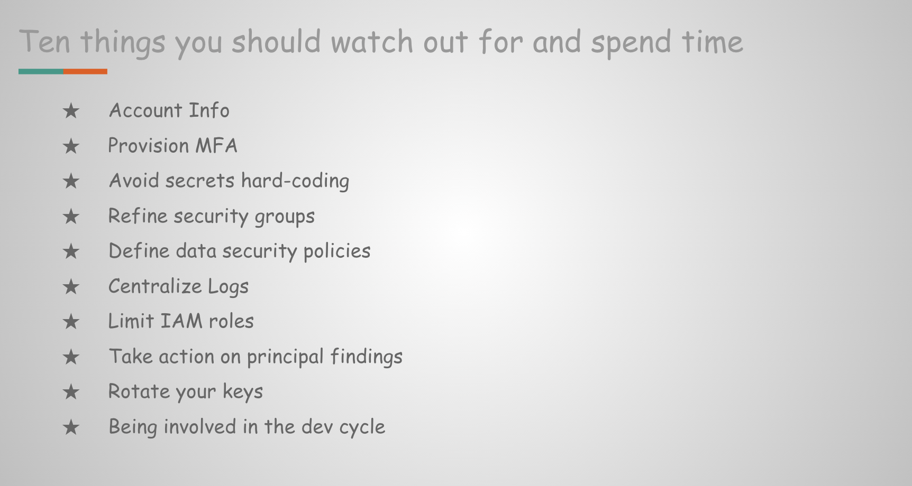

**Ten things you should watch out for and spend time**

If you’re looking to improve your cloud security, an excellent place to start is to follow the top 10 most important cloud security tips that Stephen Schmidt, Chief Information Security Officer for AWS, laid out at AWS re:Invent 2019. Underneath represent the tips, expanded to aid you to take action.

* 1) Account information 
     * Configure right contact info under AWS console management including the email address used to set up the account and those listed under Alternate Contacts. As same details are used by AWS for any communication including security breach information
     * Map a group email address under contact info instead of a single person for more reach

2) Provision multi-factor authentication (MFA)
    - MFA is the best way to preserve accounts from inappropriate access. Always set up MFA on your Root user and AWS Identity and Access Management (IAM) users
    - If you typically use AWS Single Sign-On (SSO) to restrict the direct access to AWS or to federate your corporate identity store, you can properly enforce MFA there

3) Avoid secrets hard-coding
    - While developing applications on AWS, vigorously promote to use of AWS IAM roles to deliver temporary, short-lived credentials for considering AWS services
    - For any long-lived credentials like API key or Database password leverage AWS Secrets Manager to limit such information in your application. Secrets Manager allow you to rotate, manage, and retrieve database credentials, API keys, and other secrets through their lifecycle

4) Refine security groups
    - Security groups are the entry gate to your network, ensure all required ports are opened on specific IP address or validated CIDR range. 
    - Leverage services like AWS Config or AWS Firewall Manager to programmatically ensure that the virtual private cloud (VPC) security group configuration is what you intended 

5) Define data security policies
    - Along with network security, a correct security posture is required for the data layer also like S3 buckets. It is really important to classify the data and ensure any sensitive data is not breach
    - Following are the three methods to apply the right security measures for the S3 bucket
         - S3 bucket can be secured by enabling public block access on the account
         - Enable encryption at rest or KMS for the buckets accumulating sensitive data
         - Refine and validate IAM & bucket level policies to merely ensure the precise level of permissions is granted irrespective of the specific type of bucket(public/private) 

6) Centralize logging
    - Logging and monitoring are important parts of a robust security plan. Being able to promptly investigate unexpected changes in your environment or carefully perform a comprehensive analysis to iterate on your security posture typically relies on having access to necessary data. AWS recommends that you promptly write logs to an S3 bucket in an account designated for logging (Log Archive). 
    - Once the logs are centralized, you can seamlessly integrate with possible SIEM solutions or utilize AWS services to objectively analyze them

7) Limit IAM roles
    - Ensure you have carefully limited and refined IAM roles so you don't end up creating multiple IAM roles that are not required.
    - Use AWS IAM Access Analyzer to review access to your internal AWS resources and determine where you have shared access outside your AWS accounts

8) Take action on principal findings
    - AWS managed services like AWS Security Hub, Amazon GuardDuty, and AWS Identity and Access Management Access Analyzer are easy to enable across multiple accounts
    - Precisely define appropriate responses for each of the necessary actions to take. 

9) Rotate your keys
    - Ensure all long-lived credentials like API key or Database password are rotated at regular frequency to minimize the change of incriminating it
    - AWS Secrets Manager allows you to rotate, manage, and retrieve database credentials, API keys, and other secrets through their lifecycle 

10) Be involved in the dev cycle
    - All the previous points extremely focus on enabling the right AWS services but along with that equally invest in security training for the employees and induce them to genuinely understand all the security best practice
    - Define the right security guidance/proper posture and enable it across the organization.
